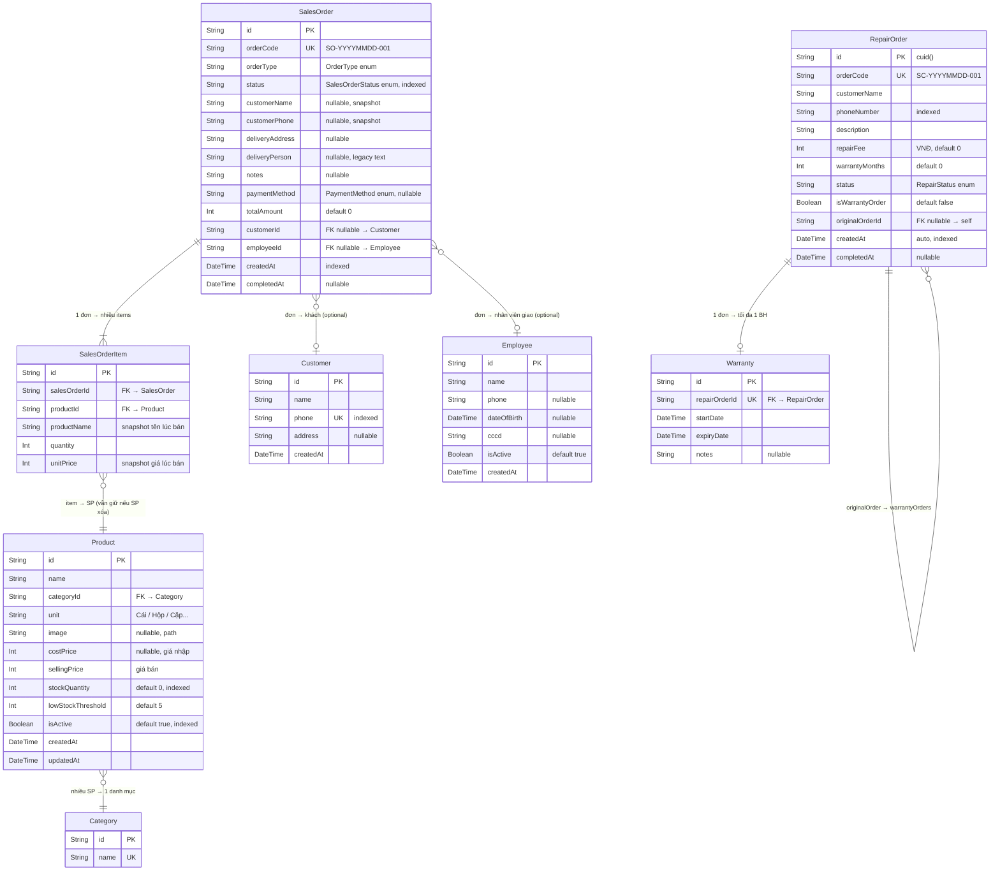

# Database Schema – Cửa Hàng Sửa Điện Thoại

> Engine: SQLite (dev) | ORM: Prisma 6  
> Tất cả PK dùng `cuid()` | Tiền tệ lưu `Int` (VNĐ, không dùng float) | Thời gian lưu UTC

---

## Sơ đồ quan hệ (ER Diagram)



---

## Chi tiết từng bảng

### RepairOrder

Bảng trung tâm của module sửa chữa.

| Field | Kiểu | Ràng buộc | Ghi chú |
|-------|------|-----------|---------|
| `id` | String | PK | cuid() |
| `orderCode` | String | UNIQUE | Tự sinh: `SC-YYYYMMDD-###` |
| `customerName` | String | NOT NULL | |
| `phoneNumber` | String | NOT NULL, INDEX | Dùng để tìm kiếm |
| `description` | String | NOT NULL | Mô tả lỗi, không giới hạn ký tự |
| `repairFee` | Int | DEFAULT 0 | VNĐ. Có thể sửa trước khi hoàn thành |
| `warrantyMonths` | Int | DEFAULT 0 | Bảo hành dự kiến lúc tạo đơn |
| `status` | Enum | DEFAULT IN_PROGRESS | `IN_PROGRESS` \| `COMPLETED` |
| `isWarrantyOrder` | Boolean | DEFAULT false | Đánh dấu đây là đơn bảo hành |
| `originalOrderId` | String? | FK self, nullable | Trỏ về đơn gốc nếu là đơn BH |
| `createdAt` | DateTime | AUTO, INDEX | |
| `completedAt` | DateTime? | nullable | Set khi POST /complete |

**Tự join (self-relation):**
```
RepairOrder A (gốc) ──1:N──► RepairOrder B, C, D (đơn BH)
B.originalOrderId = A.id
B.isWarrantyOrder = true
```

---

### Warranty

Gắn 1-1 với RepairOrder. Chỉ tồn tại nếu đơn được hoàn thành với bảo hành.

| Field | Kiểu | Ràng buộc | Ghi chú |
|-------|------|-----------|---------|
| `id` | String | PK | |
| `repairOrderId` | String | UNIQUE FK | Mỗi đơn sửa có tối đa 1 bảo hành |
| `startDate` | DateTime | NOT NULL | = completedAt của RepairOrder |
| `expiryDate` | DateTime | NOT NULL | = startDate + warrantyDurationDays |
| `notes` | String? | nullable | Điều kiện, ngoại lệ |

**isActive** không lưu DB — tính runtime: `expiryDate > NOW()`.

---

### Product

| Field | Kiểu | Ràng buộc | Ghi chú |
|-------|------|-----------|---------|
| `id` | String | PK | |
| `name` | String | NOT NULL | |
| `categoryId` | String | FK → Category | |
| `unit` | String | NOT NULL | "Cái", "Hộp", "Cặp"... |
| `image` | String? | nullable | Relative path to public/ |
| `costPrice` | Int? | nullable | Giá nhập, chỉ để tham khảo |
| `sellingPrice` | Int | NOT NULL | Giá bán, dùng tính totalAmount |
| `stockQuantity` | Int | DEFAULT 0, INDEX | Trừ khi tạo đơn, cộng khi hủy |
| `lowStockThreshold` | Int | DEFAULT 5 | Cảnh báo khi ≤ threshold |
| `isActive` | Boolean | DEFAULT true, INDEX | false = ẩn khỏi POS |
| `createdAt` | DateTime | AUTO | |
| `updatedAt` | DateTime | AUTO UPDATE | |

---

### Category

| Field | Kiểu | Ràng buộc | Ghi chú |
|-------|------|-----------|---------|
| `id` | String | PK | |
| `name` | String | UNIQUE | VD: "Phụ kiện", "Linh kiện" |

Xóa Category chỉ được khi không còn Product nào thuộc danh mục đó.

---

### SalesOrder

| Field | Kiểu | Ràng buộc | Ghi chú |
|-------|------|-----------|---------|
| `id` | String | PK | |
| `orderCode` | String | UNIQUE | Tự sinh: `SO-YYYYMMDD-###` |
| `orderType` | Enum | NOT NULL | `COUNTER` \| `DELIVERY` |
| `status` | Enum | NOT NULL, INDEX | Xem bảng trạng thái bên dưới |
| `customerName` | String? | nullable | Chỉ điền khi DELIVERY |
| `customerPhone` | String? | nullable | Chỉ điền khi DELIVERY |
| `deliveryAddress` | String? | nullable | Chỉ điền khi DELIVERY |
| `deliveryPerson` | String? | nullable | Legacy text field (cũ) |
| `notes` | String? | nullable | |
| `paymentMethod` | Enum? | nullable | Điền khi thanh toán |
| `totalAmount` | Int | DEFAULT 0 | Σ(quantity × unitPrice) |
| `customerId` | String? | FK nullable | Liên kết Customer (optional) |
| `employeeId` | String? | FK nullable | Nhân viên giao hàng |
| `createdAt` | DateTime | AUTO, INDEX | |
| `completedAt` | DateTime? | nullable | Set khi COUNTER_SALE hoặc DELIVERED |

**Bảng trạng thái:**

| Status | orderType | Ý nghĩa |
|--------|-----------|---------|
| `COUNTER_SALE` | COUNTER | Bán tại quầy, kết thúc ngay |
| `PROCESSING` | DELIVERY | Đơn đang được giao |
| `DELIVERED` | DELIVERY | Giao thành công, thu tiền |
| `CANCELLED` | DELIVERY | Hủy, stock đã được hoàn |

---

### SalesOrderItem

Bảng pivot lưu snapshot để bảo vệ lịch sử khi Product bị sửa/xóa.

| Field | Kiểu | Ràng buộc | Ghi chú |
|-------|------|-----------|---------|
| `id` | String | PK | |
| `salesOrderId` | String | FK → SalesOrder | |
| `productId` | String | FK → Product | |
| `productName` | String | NOT NULL | **Snapshot** tên tại thời điểm bán |
| `quantity` | Int | NOT NULL | |
| `unitPrice` | Int | NOT NULL | **Snapshot** giá bán tại thời điểm bán |

> **Tại sao snapshot?** Nếu sản phẩm đổi tên/giá sau khi đặt hàng, lịch sử đơn cũ vẫn hiển thị đúng.

---

### Customer

| Field | Kiểu | Ràng buộc | Ghi chú |
|-------|------|-----------|---------|
| `id` | String | PK | |
| `name` | String | NOT NULL | |
| `phone` | String | UNIQUE, INDEX | Dùng để tìm kiếm autocomplete |
| `address` | String? | nullable | |
| `createdAt` | DateTime | AUTO | |

---

### Employee

| Field | Kiểu | Ràng buộc | Ghi chú |
|-------|------|-----------|---------|
| `id` | String | PK | |
| `name` | String | NOT NULL | |
| `phone` | String? | nullable | |
| `dateOfBirth` | DateTime? | nullable | |
| `cccd` | String? | nullable | Căn cước công dân |
| `isActive` | Boolean | DEFAULT true | false = nghỉ việc, ẩn khỏi danh sách giao |
| `createdAt` | DateTime | AUTO | |

---

## Index tổng hợp

| Bảng | Field | Loại | Mục đích |
|------|-------|------|---------|
| RepairOrder | `phoneNumber` | INDEX | Tìm theo SĐT |
| RepairOrder | `status` | INDEX | Filter đang sửa / hoàn thành |
| RepairOrder | `createdAt` | INDEX | Sort, export, dashboard |
| Product | `isActive` | INDEX | Filter POS (chỉ sản phẩm đang bán) |
| Product | `stockQuantity` | INDEX | Cảnh báo tồn kho thấp |
| SalesOrder | `status` | INDEX | Filter đơn đang giao |
| SalesOrder | `orderType` | INDEX | Filter counter vs delivery |
| SalesOrder | `createdAt` | INDEX | Sort, export, dashboard |
| Customer | `phone` | INDEX | Autocomplete lookup |
| Warranty | `repairOrderId` | UNIQUE | Đảm bảo 1 đơn → tối đa 1 BH |

---

## Quyết định thiết kế quan trọng

### 1. Tiền tệ dùng Int, không dùng Float
Tất cả giá tiền (repairFee, sellingPrice, costPrice, unitPrice, totalAmount) lưu là `Int` (đồng VNĐ).  
Lý do: tránh sai số floating-point khi cộng/tính. VNĐ không có lẻ xu.

### 2. SalesOrderItem lưu snapshot tên và giá
`productName` và `unitPrice` được copy vào `SalesOrderItem` tại thời điểm tạo đơn.  
Lý do: bảo vệ lịch sử — khi Product đổi tên hoặc thay đổi giá, các đơn cũ vẫn đúng.

### 3. Customer.phone là unique
Mỗi SĐT chỉ có một Customer. Dùng SĐT làm định danh chính cho lookup autocomplete.

### 4. warrantyMonths lưu trên RepairOrder, Warranty lưu ngày thực tế
- `RepairOrder.warrantyMonths` = kế hoạch bảo hành lúc tạo đơn (hiển thị "Dự kiến BH 6T")
- `Warranty.expiryDate` = ngày thực tế tính từ completedAt (nguồn sự thật khi kiểm tra BH)

### 5. SalesOrder lưu cả customerName và customerId
- `customerId` (FK): liên kết nếu khách có trong hệ thống  
- `customerName`, `customerPhone` (snapshot): bảo vệ thông tin nếu Customer bị xóa sau này

### 6. Employee.isActive vs Employee deleted
Nhân viên nghỉ việc KHÔNG bị xóa khỏi DB (sẽ mất lịch sử đơn giao hàng).  
Thay vào đó dùng `isActive = false` để ẩn khỏi dropdown khi tạo đơn mới.

### 7. Warranty tự join RepairOrder
Đơn bảo hành (`isWarrantyOrder=true`) là một RepairOrder bình thường với `originalOrderId` trỏ về đơn gốc.  
Lợi ích: dùng lại toàn bộ flow sửa chữa cho bảo hành, không cần bảng riêng.

---

## Phạm vi v1.0 (Out of scope)

Những bảng/quan hệ sau KHÔNG có trong schema v1.0 và sẽ được xem xét ở phiên bản sau:

| Tính năng | Lý do chưa có |
|-----------|---------------|
| Supplier (nhà cung cấp) | Chưa cần quản lý nhập hàng từ nguồn |
| Invoice / Receipt | Không in hóa đơn VAT trong v1 |
| UserAccount / Role | Single-user, chưa cần auth đa người dùng |
| StockTransaction log | Stock chỉ xem số dư, chưa cần lịch sử từng lần |
| Notification | Không tích hợp Zalo/SMS/push |
| OnlinePayment | Chỉ ghi nhận phương thức, không xử lý cổng thanh toán |
